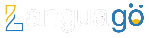

<h1>Apa Itu Languago</h1>

Languago adalah platform kurses bahasa inggris dan memberikan solusi pembelajaran bahasa yang mudah diakses, efektif, terjangkau, meningkatkan pemahaman dan wawasan untuk persiapan tes TOEFL. Kami percaya bahwa bahasa tidak boleh menjadi penghalang komunikasi dan setiap orang harus mempunyai kesempatan untuk belajar bahasa baru.

<h1>Our Team</h1>
<ul>
	<li>Asima Beatricia Zivanka Rajagukguk (Project Leader)</li>
	<li>Eri Sukmawan (Front End Engineer)</li>
	<li>Yonatan Setiawan (Front End Engineer)</li>
	<li>Hawra Fathiya Zahra (Back End Engineer)</li>
	<li>Raey Brian (Back End Engineer)</li>
	<li>Delfania Agustin (Quality Assurance)</li>
</ul>

<h1>Feature</h1>
<ul>
	<li>Program (Grammar, Writing, Reading, Speaking, Pre-TOEFL, Pre-IELTS)</li>
	<li>Testimoni</li>
	<li>Kontak Kami</li>
	<li>Tentang Kami</li>
	<li>FAQ - Frequently Asked Question</li>
</ul>

<h1>Link Github Pages</h1>
https://kampus-merdeka-software-engineering.github.io/front-end-capstone-project-section-semarang-group-15
